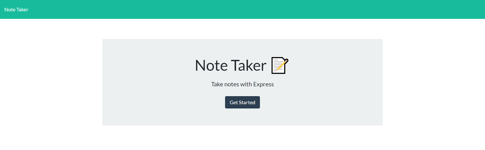
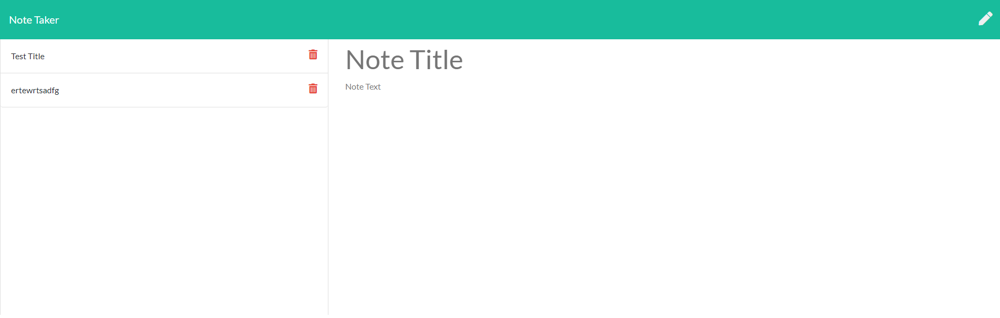

# Note Taker Application
  

## Description
Press "Get Started" to launch to the main page where you can create and save reminders and notes!
    
## Table of Contents
### - [Installation](#installation)
### - [Usage](#usage)
### - [Tests](#tests)
### - [Credits](#credits)
### - [License](#license)
### - [Contact](#contact)

## Usage
Can be found deployed on Heroku at: https://gentle-inlet-47245.herokuapp.com/

Home page:

Notes page:

## License: MIT license
For more information visit https://opensource.org/licenses/MIT
    
## Contact
For any questions contacts, you can reach me at: tessa.elise.robinson@gmail.com
To view my github profile, and other projects, please visit; github.com/tessie-the-messy